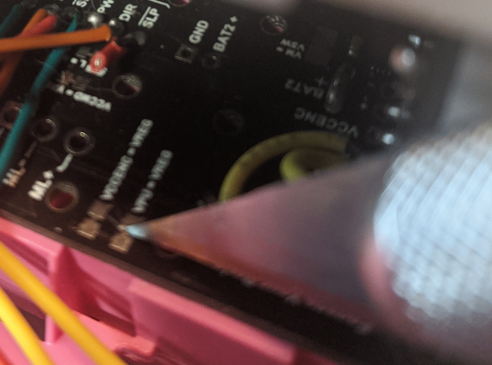

# 0) Start with power disconnected

Do not put in batteries until the instructions say to. Do not skip around, do these in order. 

DO not plug in the USB until the instructions say to. 

# 1) Assemble the Chassis Electronics

We will be wireing this module:

https://www.pololu.com/product/3543

to our ESP32. 

First, place the headers closest to the edge of the board in the encoder holes


Then solder the headers for the motors to the Driver Board


Put the dual-battery contacts into the chassis:


Flip the Romi over and add the single contacts, Squeeze the spring to fit it into its hole:


Add the positive termials


With your 4 battery contacts in place, place the driver board on top:


Solder the battery contacts


Add the motor Clips to both sides


Slide the motor in, being careful to get the motor pins into the receiving socket you soldered earlier:


Once aligned, fully seat the motor


Do the same for the other motor


# 2) Cut the Encoder Pull Up Trace

The trace

```
VPU=VREG
```

Needs to be cut with a sharp razor or X-Acto. 




# 3) Add Long Wires to Driver Board

All wires should be 100 to 200 mm long. 

Be sure to use sane color codes. 
 * White for 5v
 * Red for 3.3v
 * Black for ground
 * Green for Motor PWM
 * Orange for Motor Direction
 * Yellow for encoder signals
 
The pins that need wires are as follows:

 * VPU    ( the pull up high side that needs to go to 3.3v)
 * VCC MD (Our 5v regulated output from the batteries)
 * ~SLP   (to disable the motors)
 * Left PWM (PWM setting the speed of the left motor)
 * Left DIR  (Direction flag for the left motor)
 * Right PWM (PWM setting the speed of the right motor)
 * Right DIR (Direction flag for the right motor)
 * GND (Ground reference)
 * ELA ( Left encoder A)
 * ELB ( Left encoder B)
 * ERA ( right encoder A)
 * ERB ( right encoder B)
 

 
# 4) Wire up the ESP32
 
 * VPU   to 3v3
 * VCC MD to VUSB
 * GND to GND on the Esp32
 * ~SLP   to GND to disable, floating to enable, start with it disabled
 
## STOP and verify this is correct

Use your multi-meter to check that:

1) 5v and Gnd are NOT  connected
1) 5v and 3.3v are NOT connected (NOTE if they ARE, you likely missed step 2, or didn't cut it fully)
1) 3.3v and GND are NOT connected
1) GND on the driver board and GND on the ESP32 ARE connected

## Add the GPIO signals
 * Left PWM to GPIO 5/SCK
 * Left DIR  to GPIO 4/ A5
 * Right PWM to GPIO 15 
 * Right DIR to GPIO 24/ A1
 * ELA to GPIO 19/MISO
 * ELB to GPIO 18/MOSI
 * ERA to GPIO 17/TX1
 * ERB to GPIO 16/RX1
 
# 5) Power up and test Voltages

Plug in the Esp32 USB cable and add the batteries. 

1) Check 5v pin is at 5v +-0.1v
1) Check 3.3v pin is at 3.3v +-0.1v
1) Power on the battery and unplug the USB
1) Check 5v and 3.3v again
 
# 6) Program the Esp32 with the Motor Test Example


Plug the USB back in. Make sure the Motor ~SLP pin is in GND. 

Open Arduino IDE and program the example 

```
RBE1001Lib/MotorTest
```

Open the serial monitor after programming. 

After programming, take ~SLP and connect it to an open breadboard rail. One motor should start moving.

Change the example to check the other motor. 
 
