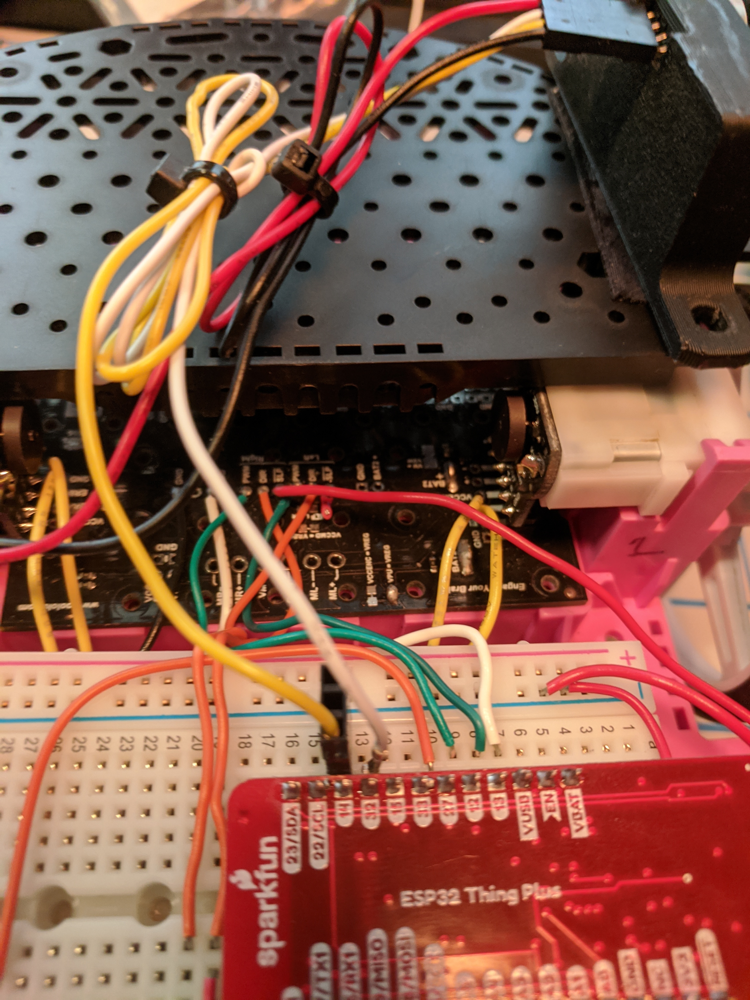

# Ultrasonic Range Finder

Vcc to 3.3v

Gnd to Gnd

Echo to GPIO 16

Trig to GPIO 17

# Line Sensors

Vcc to 3.3v 

Gnd to Gnd

Sensor 3 to GPIO 36/A4

Sensor 9 to GPIO 39/A3

# Servo

Servo Black to Ground

Servo Red to 5v/VUSB

Servo White to GPIO 33

Servo Green to GPIO 34/A2
